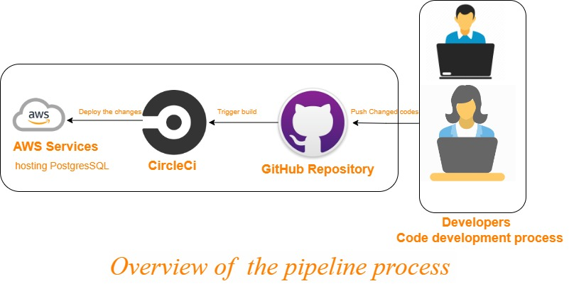

## Overview-pipeline-process

## Pipeline process
1. Developer make chaanges on codes.
2. Push their code to GitHub repository.
3. The GitHub repository is trigger build on CircleCi.
4. CirlceCi will deploy the changes on Aws Services.
### The pipeline will follow all commands that's saved on config.yml 